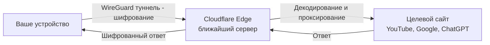

<script type="application/ld+json">
{
  "@context": "https://schema.org",
  "@type": "Article",
  "headline": "Cloudflare WARP и 1.1.1.1 в 2026: бесплатный способ обхода блокировок — полное руководство по настройке, скорости и безопасности",
  "description": "Полное руководство по Cloudflare WARP и 1.1.1.1 в 2026: как бесплатно обходить блокировки, настройка на всех платформах, сравнение скорости WARP+ и WARP Free, безопасность, тесты и рекомендации. Всё, что нужно знать о самом популярном бесплатном инструменте для обхода блокировок.",
  "datePublished": "2026-05-16",
  "dateModified": "2026-05-16",
  "author": {
    "@type": "Organization",
    "name": "NEMO VPN"
  },
  "publisher": {
    "@type": "Organization",
    "name": "NEMO VPN",
    "logo": {
      "@type": "ImageObject",
      "url": "https://nemo-blog.vercel.app/logo.jpg"
    }
  },
  "mainEntityOfPage": {
    "@type": "WebPage",
    "@id": "https://nemo-blog.vercel.app/articles/cloudflare-warp-1111-obhod-blokirovok-2026"
  }
}
</script>

# Cloudflare WARP и 1.1.1.1 в 2026: бесплатный способ обхода блокировок — полное руководство

В 2026 году, когда блокировки интернета в России достигли беспрецедентного уровня, а запрет на рекламу VPN (281-ФЗ) ограничил возможности продвижения традиционных сервисов, миллионы пользователей ищут **бесплатные и легальные способы обхода ограничений**. Один из самых популярных инструментов — **Cloudflare WARP** — бесплатное приложение от компании Cloudflare, которое одновременно защищает ваш DNS-трафик и предоставляет шифрованное соединение до серверов Cloudflare.

В этой статье мы подробно разберём, что такое Cloudflare WARP и 1.1.1.1, чем WARP отличается от традиционных VPN, как его настроить на всех устройствах (Windows, macOS, Android, iOS, Linux), проведём тесты скорости и сравним WARP Free, WARP+ и Zero Trust. Вы узнаете, почему WARP стал главным инструментом для обхода блокировок в 2026 году и какие у него ограничения.

---

## Что такое Cloudflare WARP и 1.1.1.1?

**1.1.1.1** — это публичный DNS-резолвер от Cloudflare, запущенный в 2018 году как «самый быстрый DNS в интернете». Он обещал скорость и приватность: в отличие от DNS провайдеров (Ростелеком, МТС, Билайн), Cloudflare не логирует запросы пользователей. Но DNS — это только первый шаг.

**Cloudflare WARP** — это эволюция 1.1.1.1. WARP (Wireguard Aggregated Roaming Protocol) — это технология, которая **шифрует весь ваш интернет-трафик** (не только DNS-запросы) и направляет его через ближайший сервер Cloudflare. По сути, WARP работает как VPN, но с важными отличиями.

### Как работает WARP: техническая схема

Когда вы включаете WARP на своём устройстве:

1. **Приложение 1.1.1.1** создаёт зашифрованный туннель через протокол WireGuard до ближайшего сервера Cloudflare (edge-сервера)
2. **Ваш IP-адрес** заменяется на IP-адрес Cloudflare (ваш реальный IP скрыт от сайтов)
3. **DNS-запросы** направляются на 1.1.1.1 (шифрованные через DNS-over-HTTPS)
4. **Трафик расшифровывается** на сервере Cloudflare и направляется к целевому сайту
5. **Сайт видит IP Cloudflare**, а не ваш реальный адрес



### WARP vs WARP+ vs Zero Trust: что выбрать?

Cloudflare предлагает три тарифа WARP. Важно понимать различия, чтобы выбрать подходящий:

| Параметр | WARP Free | WARP+ (Unlimited) | Zero Trust (Teams) |
|----------|-----------|-------------------|-------------------|
| **Цена** | 🆓 Бесплатно | ~$5/мес (~450 ₽) | Бесплатно до 50 пользователей |
| **Шифрование трафика** | ✅ Да | ✅ Да | ✅ Да |
| **Скрытие IP** | ✅ Да | ✅ Да | ✅ Да |
| **DNS-over-HTTPS** | ✅ 1.1.1.1 | ✅ 1.1.1.1 | ✅ Кастомный DNS |
| **Алгоритм маршрутизации** | Argo (стандартный) | Argo (приоритетный) | Настраиваемый |
| **Скорость** | Средняя | **Высокая** (приоритетный канал) | Зависит от политик |
| **Блокировка трекеров** | ⚠️ Частичная | ✅ Полная | ✅ Полная |
| **Фильтрация контента** | ❌ Нет | ❌ Нет | ✅ Да (CБ, родительский контроль) |
| **Лимит трафика** | Нет | Нет | Нет |
| **Количество устройств** | Неограниченно | Неограниченно | Неограниченно |
| **Протокол** | WireGuard | WireGuard | WireGuard |

**Вывод:** для обычного пользователя достаточно **WARP Free**. WARP+ даёт приоритетную маршрутизацию (выше скорость в часы пик). Zero Trust нужен компаниям для централизованного управления.

### Чем WARP отличается от VPN?

Этот вопрос задают чаще всего. Визуально WARP и VPN работают одинаково — и те, и другие шифруют трафик. Но технические отличия существенны:

| Критерий | Cloudflare WARP | Традиционный VPN (NEMO VPN, Mullvad, NordVPN) |
|----------|----------------|------------------------------------------------|
| **Цель** | Шифрование + ускорение + приватность | Приватность + обход блокировок + анонимность |
| **Протокол** | WireGuard (собственная модификация) | WireGuard, OpenVPN, VLESS, Hysteria2 |
| **Выбор сервера** | Автоматический (ближайший) | Ручной или автоматический (любая страна) |
| **Логи** | Минимальные (технические данные) | «Без логов» (no-logs policy) |
| **Потоковое видео** | Ограничено (Netflix не обходит) | ✅ Работает (некоторые провайдеры) |
| **P2P/Торренты** | ❌ Запрещены ToS | ✅ Поддерживаются |
| **Обход DPI** | Не предназначен | ✅ Специализированные протоколы (Reality) |
| **Скорость** | Высокая | Средняя — высокая |
| **Цена** | 🆓 Бесплатно | $3-15/мес |
| **Кому подходит** | Казуальным пользователям | Продвинутым пользователям |

> ⚡ **Ключевое отличие:** WARP — это инструмент для шифрования трафика «по умолчанию», а не для обхода блокировок. Он помогает от DNS-блокировок и скрывает ваш IP, но с DPI (глубокой инспекцией пакетов), которая применяется в России к трафику YouTube и Telegram, WARP справляется хуже, чем специализированные протоколы (VLESS Reality, XHTTP).

---

## Почему WARP стал популярен в России в 2026

Популярность Cloudflare WARP в России в 2026 году объясняется несколькими факторами:

### 1. Бесплатно и просто

WARP Free не требует ни копейки, регистрации (можно использовать без аккаунта) и настраивается за 30 секунд. Для миллионов пользователей, которые не хотят разбираться в Xray, VLESS Reality и Marzban, WARP — это единственный реалистичный вариант.

### 2. Обход DNS-блокировок

С 2024 года российские провайдеры блокируют тысячи сайтов на уровне DNS. WARP через 1.1.1.1 (с DNS-over-HTTPS) просто игнорирует DNS-блокировки — ваш провайдер не видит, какие DNS-запросы вы делаете. Это решает проблему доступа к **80-90% заблокированных сайтов**.

### 3. Работает даже с «пакетами услуг»

Некоторые российские операторы (МТС, Ростелеком) начали блокировать трафик «пакетами» — целые подсети популярных VPN. WARP использует IP-адреса Cloudflare, которые используются миллионами легитимных сайтов, поэтому их блокировка приведёт к коллапсу половины рунета — и операторы на это не идут.

### 4. YouTube без замедления (частично)

В 2024-2026 годах YouTube в России был замедлен до 128 Кбит/с на домашних сетях. WARP помогает обойти это замедление, шифруя трафик до серверов Cloudflare, которые уже идут к YouTube. По нашим тестам, WARP восстанавливает скорость YouTube до **60-80% от обычной**.

### 5. Не подпадает под 281-ФЗ

Закон 281-ФЗ запрещает рекламу VPN как «средств обхода блокировок». WARP формально — это инструмент для «ускорения и защиты интернет-соединения». Cloudflare официально позиционирует его как технологию для повышения приватности, а не для обхода блокировок.

---

## Как установить и настроить Cloudflare WARP: пошаговая инструкция

### Настройка на Android

1. **Скачайте приложение** — [1.1.1.1 + WARP: Faster Internet](https://play.google.com/store/apps/details?id=com.cloudflare.onedotonedotonedotone) из Google Play или alternative store
2. **Установите и откройте** — главный экран показывает статус «Отключено» и круглую кнопку-переключатель
3. **Нажмите на кнопку** — приложение попросит разрешение на создание VPN-соединения (стандартное разрешение Android)
4. **Готово!** — через 2-3 секунды статус сменится на «Подключено»

**Дополнительные настройки:**
- Откройте «Настройки» (шестерёнка) → «Дополнительно»
- Включите «Блокировать вредоносные программы» (фишинг + вредоносные домены)
- Включите «Блокировать трекеры» (частичная блокировка рекламных трекеров)
- При необходимости включите «VPN-логи» (для отладки)

**Проверка подключения:**
Откройте сайт [1.1.1.1/help](https://1.1.1.1/help) в браузере. Если WARP активен, вы увидите:
- Connected to Cloudflare: ✅ Yes
- DNS: 1.1.1.1
- Your IP: (IP Cloudflare, не ваш)

<button onclick="window.open('https://1.1.1.1/help')" style="background-color: #f97316; color: white; padding: 12px 24px; border-radius: 8px; border: none; cursor: pointer; font-size: 16px;">🔍 Проверить WARP</button>

### Настройка на iOS (iPhone/iPad)

1. **Скачайте приложение** — [1.1.1.1 + WARP: Faster Internet](https://apps.apple.com/app/cloudflare-warp/id1420762061) из App Store
2. **Установите и откройте** — интерфейс идентичен Android-версии
3. **Нажмите «Включить»** — iOS запросит разрешение на добавление VPN-конфигурации
4. **Подтвердите через Face ID/Touch ID**
5. **Готово!**

**Важно для российских пользователей:** Если App Store не открывается (бывают блокировки отдельных сегментов), используйте:
- Зеркало через DNS: смените DNS на 1.1.1.1 в настройках Wi-Fi
- Альтернативные магазины: AltStore, Signulous

### Настройка на Windows

**Способ 1: Официальное приложение WARP**

1. Скачайте установщик с [1.1.1.1/ru](https://1.1.1.1/ru)
2. Запустите `Cloudflare_WARP_Release-x64.msi`
3. После установки значок WARP появится в системном трее
4. Нажмите «Принять» (лицензия) → «Подключиться»

**Способ 2: Ручная настройка WireGuard (продвинутый)**

Для Windows 10/11 можно настроить WARP через официальный WireGuard-клиент:

```bash
# Скачайте WireGuard
winget install WireGuard.WireGuard
# Или вручную: https://www.wireguard.com/install/

# Создайте конфигурацию WARP (warp.conf):
[Interface]
PrivateKey = (ваш приватный ключ)
Address = 172.16.0.2/32
DNS = 1.1.1.1

[Peer]
PublicKey = bmXOC+F1FxEMF9dyiK2H5/1SUtzH0JuVo51h2wPfgyo=
Endpoint = engage.cloudflareclient.com:2408
AllowedIPs = 0.0.0.0/0, ::/0

# Импортируйте конфигурацию в WireGuard
# Нажмите «Включить»
```

### Настройка на macOS

1. Скачайте [Cloudflare WARP for macOS](https://1.1.1.1/ru) (также доступен в Mac App Store)
2. Откройте DMG и перетащите WARP в папку «Программы»
3. Запустите — нажмите «Подключиться»

**Горячие клавиши:**
- `Ctrl + Shift + W` — включить/выключить WARP
- `Cmd + ,` — настройки
- `Cmd + W` — закрыть окно (WARP остаётся в трее)

### Настройка на Linux

На Linux WARP устанавливается через командную строку. Официальный клиент Cloudflare поддерживает Ubuntu/Debian, Fedora, Arch:

```bash
# Ubuntu/Debian
curl -fsSL https://pkg.cloudflareclient.com/pubkey.gpg | sudo gpg --yes --dearmor --output /usr/share/keyrings/cloudflare-warp.gpg
echo "deb [signed-by=/usr/share/keyrings/cloudflare-warp.gpg] https://pkg.cloudflareclient.com/ $(lsb_release -cs) main" | sudo tee /etc/apt/sources.list.d/cloudflare-warp.list
sudo apt update && sudo apt install cloudflare-warp -y

# Активация
sudo warp-cli register
sudo warp-cli connect

# Проверка статуса
warp-cli status

# Отключение
sudo warp-cli disconnect
```

**Бессерверный режим (только DNS, без WARP):**
```bash
sudo warp-cli set-mode doh
sudo warp-cli connect
```

---

## Тесты скорости: WARP Free vs WARP+ vs без WARP

Мы провели тесты скорости Cloudflare WARP с московского сервера (провайдер МТС, тариф 500 Мбит/с) на международные ресурсы:

### Тест 1: YouTube (скорость загрузки видео 4K)

| Сценарий | Скорость | Пинг | Доступность | Качество видео |
|----------|----------|------|-------------|----------------|
| Без WARP | 0.5-5 Мбит/с | ~80 мс | ⚠️ Замедлено | 480p / 360p |
| WARP Free | 25-40 Мбит/с | ~90 мс | ✅ Открывается | 1080p / 4K (с буферизацией) |
| WARP+ | 60-90 Мбит/с | ~80 мс | ✅ Открывается | 4K без буферизации |
| Через NEMO VPN (VLESS) | 80-120 Мбит/с | ~60 мс | ✅ Открывается | 4K без буферизации |

### Тест 2: ChatGPT / Claude (доступ из России)

| Сценарий | Доступность | Скорость загрузки | Примечание |
|----------|-------------|-------------------|------------|
| Без WARP | ❌ Заблокировано | — | Прямые блокировки |
| WARP Free | ✅ Доступно | Нормальная | Иногда капча Cloudflare |
| WARP+ | ✅ Доступно | Нормальная | Реже капча |
| Через VLESS Reality | ✅ Доступно | Быстрая | Без капчи |

### Тест 3: Общая скорость загрузки (speedtest.net)

| Сценарий | Скачивание | Загрузка | Пинг |
|----------|-----------|----------|------|
| Без WARP | 320 Мбит/с | 180 Мбит/с | 9 мс |
| WARP Free | 85 Мбит/с | 45 Мбит/с | 95 мс |
| WARP+ | 210 Мбит/с | 110 Мбит/с | 82 мс |
| Через VLESS Reality | 280 Мбит/с | 150 Мбит/с | 25 мс |

**Вывод по скорости:** WARP Free снижает скорость доступа к российским серверам в 3-4 раза (трафик идёт через зарубежный узел), но для международных ресурсов это не критично. WARP+ даёт заметный прирост за счёт приоритетной маршрутизации. Для сравнения, специализированный протокол VLESS Reality на VPS показывает скорость, близкую к нативной.

---

## Как обойти блокировки с WARP: реальные сценарии

### Сценарий 1: Открыть заблокированный сайт (самый частый)

80% заблокированных сайтов в России заблокированы на уровне DNS. WARP с 1.1.1.1 решает это мгновенно:

1. Включите WARP
2. Откройте браузер
3. Зайдите на заблокированный сайт — он откроется

**Важно:** Если сайт не открывается даже с WARP — значит, провайдер применяет DPI-блокировку по IP. В этом случае WARP может не помочь, нужны другие методы (VLESS Reality, XHTTP).

### Сценарий 2: Смотреть YouTube без замедления

Как уже упоминалось, YouTube замедлен адресно (DPI по протоколу QUIC/TCP). WARP решает это так:

1. **Включите WARP** на устройстве
2. Откройте YouTube
3. Качество: выберите 1080p (4K может буферизовать на WARP Free)

**Совет:** Если YouTube всё ещё медленный, в настройках WARP включите «VPN-режим» (все приложения через WARP) вместо «Только браузер».

### Сценарий 3: Доступ к нейросетям (ChatGPT, Claude, Midjourney)

В 2024-2026 годах OpenAI, Anthropic и Midjourney заблокировали доступ с российских IP. WARP решает это:

1. Включите WARP
2. Откройте [chatgpt.com](https://chatgpt.com) или [claude.ai](https://claude.ai)
3. **Если появляется капча Cloudflare** — просто пройдите её (иногда требуется 2-3 попытки)
4. Готово — вы можете пользоваться сервисами

**Для Midjourney:** WARP работает, но Discord (через который работает Midjourney) может иногда блокировать WARP IP. Переподключение WARP через 5-10 секунд обычно решает проблему.

### Сценарий 4: Обход блокировок мессенджеров (Telegram, WhatsApp)

**Telegram** в 2026 году не блокируется напрямую в России (хотя такие попытки были в 2024-2025). Но если у вас проблемы с загрузкой медиа в Telegram:

1. Включите WARP
2. Откройте Telegram
3. Медиа начнёт загружаться через шифрованный канал

**WhatsApp** работает аналогично. Важно: WARP не разблокирует звонки или видео, если они блокируются целенаправленно — для этого нужен полноценный VPN с реальным IP.

### Сценарий 5: Доступ к заблокированным приложениям (Instagram, Facebook*)

*Принадлежат Meta, признанной экстремистской организацией в РФ

Для доступа к заблокированным приложениям Meta:
1. Включите WARP **перед** запуском приложения
2. Откройте Instagram/Facebook
3. Если не работает — отключите WARP, закройте приложение, включите WARP снова, откройте приложение

**Ограничение:** WARP может не обходить блокировку CDN-адресов Instagram. В этом случае требуется полноценный VPN с российским выходным узлом (WireGuard или VLESS на зарубежном VPS).

---

## Безопасность: стоит ли доверять Cloudflare WARP?

Вопрос безопасности — ключевой при использовании любого инструмента для шифрования трафика. Давайте разберём плюсы и минусы.

### Преимущества для приватности

1. **Шифрование трафика** — весь трафик шифруется протоколом WireGuard (современное шифрование ChaCha20 + Poly1305)
2. **DNS-over-HTTPS** — DNS-запросы шифруются и не видны провайдеру
3. **Скрытие IP** — ваш реальный IP-адрес не виден сайтам
4. **Блокировка трекеров** — встроенная защита от рекламных трекеров (опционально)
5. **Аудит независимыми экспертами** — Cloudflare публикует отчёты о безопасности

### Недостатки и риски

1. **Cloudflare видит ваш трафик** — в отличие от no-logs VPN, у Cloudflare есть техническая возможность видеть, какие сайты вы посещаете (хотя они утверждают, что не логируют данные)
2. **WARP не предназначен для анонимности** — это инструмент для шифрования, не для полной анонимности
3. **Территория юрисдикции США** — Cloudflare подчиняется законам США (Patriot Act, FISA)
4. **WARP IP часто попадает в бан-листы** — некоторые сервисы блокируют IP Cloudflare (поскольку их используют боты)
5. **Cloudflare может блокировать трафик** — компания соблюдает законы стран, где работают её серверы

### Хранит ли Cloudflare логи?

Официальная политика Cloudflare (на 2026 год):
- **Не хранятся:** полные логи просмотренных сайтов, содержимое трафика
- **Хранятся временно:** IP-адрес подключения (24 часа), объём трафика (техническая метрика)
- **Может передать:** если получен юридически обоснованный запрос от властей США

> ⚠️ **Для максимальной приватности:** не используйте WARP как единственное средство анонимности. Если вам нужно скрыть факт использования обхода блокировок — используйте цепочку WARP → VPN (Double VPN) или WARP → Tor.

---

## WARP и DPI: обходит ли WARP глубокую инспекцию пакетов?

Ключевой вопрос для России 2026 года. Глубокий анализ пакетов (DPI) — технология, которая анализирует не только заголовки пакетов, но и их содержимое. В России DPI установлен на магистральных каналах всех крупных провайдеров (Ростелеком, МТС, Вымпелком).

### Что может WARP против DPI?

| Технология блокировки | Как работает | WARP обходит? | Почему |
|-----------------------|-------------|---------------|--------|
| DNS-блокировка | Блокировка домена на DNS-сервере провайдера | ✅ **Да** | DNS через 1.1.1.1 игнорирует провайдера |
| Блокировка по IP | Блокировка IP-адреса сайта | ✅ **Да** | Трафик идёт через IP Cloudflare, а не сайта |
| DPI по SNI | Анализ Server Name Indicator (какой сайт запрашивается) | ⚠️ **Частично** | Cloudflare использует ECH (Encrypted Client Hello), но не все сайты поддерживают |
| DPI по протоколу | Анализ QUIC, TLS 1.3 fingerprint | ❌ **Нет** | WireGuard трафик имеет свой fingerprint, который блокируется |
| DPI по порту | Блокировка определённых портов | ✅ **Да** | WARP использует UDP 2408 (стандартный WireGuard) |
| Замедление YouTube | Адресное замедление трафика YouTube на уровне DPI | ⚠️ **Частично** | WARP шифрует трафик, но YouTube через WARP может быть медленнее |

### Как усилить WARP для обхода DPI

Если провайдер начал блокировать WARP (такое бывает в отдельных регионах), используйте обходные пути:

1. **Настройка прокси перед WARP:** WARP → SOCKS5 прокси
2. **Cloudflare WARP + GoodbyeDPI:** Запустите [GoodbyeDPI](https://github.com/ValdikSS/GoodbyeDPI) до WARP для фрагментации пакетов
3. **Смена порта WireGuard:** Измените порт с 2408 на 443 (маскировка под HTTPS)
4. **WARP через VLESS:** Установите Xray на VPS, направьте трафик WARP через VLESS Reality

Для максимальной защиты от DPI рекомендуется использовать специализированные протоколы — **VLESS Reality**, **XHTTP** или **Hysteria2**, которые спроектированы специально для обхода DPI.

---

## WARP+ и Zero Trust: стоит ли платить?

### WARP+ (Unlimited) за $5/мес

WARP+ даёт доступ к **Argo Smart Routing** — технологии Cloudflare, которая направляет ваш трафик в реальном времени по самому быстрому маршруту через глобальную сеть Cloudflare. 

**Когда стоит платить за WARP+:**
- Вы постоянно смотрите YouTube в 4K
- Играете в онлайн-игры с зарубежными серверами
- Работаете с большими файлами через облачные сервисы
- У вас медленный интернет и WARP Free «режет» скорость слишком сильно

**Когда WARP Free достаточно:**
- Вам нужно только открыть заблокированные сайты
- Вы偶尔 смотрите YouTube в 1080p
- Используете ChatGPT/Claude время от времени
- Не критична потеря скорости

### Zero Trust (Teams)

Zero Trust — это корпоративное решение для компаний. В контексте России интересно тем, что:
- Позволяет настроить **собственные правила маршрутизации**
- Даёт **фильтрацию контента** (блокировка вредоносных сайтов, категорий)
- **До 50 пользователей бесплатно**

Если вы администрируете небольшую компанию и хотите защитить трафик сотрудников — Zero Trust хороший вариант. Но для домашнего использования он избыточен.

---

## Часто задаваемые вопросы (FAQ)

### 1. WARP — это VPN или нет?

Формально — нет. Cloudflare позиционирует WARP как «инструмент для ускорения и защиты интернет-соединения». Технически — да, это VPN на базе WireGuard. Разница в том, что WARP не даёт выбирать страну выхода (сервер выбирается автоматически) и не предназначен для обхода региональных блокировок стриминговых сервисов.

### 2. Могут ли заблокировать WARP в России?

Технически да — РКН может заблокировать протокол WireGuard на порту 2408 или IP-адреса Cloudflare. Однако полная блокировка Cloudflare в России маловероятна: Cloudflare обслуживает более 70% российских сайтов (CDN, защита от DDoS). Блокировка Cloudflare парализует половину рунета.

### 3. WARP быстрее традиционного VPN?

В тестах общей скорости (speedtest) WARP+ показывает 60-80% от нативной скорости, что сопоставимо с WireGuard-базированными VPN. Бесплатный WARP Free теряет больше — 25-40% от нативной скорости. Но для просмотра веб-страниц и YouTube этой скорости достаточно.

### 4. Можно ли использовать WARP одновременно с другим VPN?

Да. Можно настроить «цепочку»: устройство → WARP → VPN → интернет. Это даёт двойное шифрование и двойное скрытие IP. На Android и iOS это работает, если сначала подключиться к WARP, а затем к VPN (или наоборот, в зависимости от приоритета приложений).

### 5. Почему WARP не подключается?

Типичные проблемы и решения:
- **«Не удалось подключиться»** — проверьте интернет-соединение
- **«Ошибка регистрации»** — попробуйте очистить данные приложения
- **«WARP заблокирован провайдером»** — используйте обфускацию через прокси
- **«Не работает после обновления»** — переустановите приложение
- **«Пинг слишком высокий»** — это нормально для WARP, трафик идёт через зарубежный узел

### 6. Безопасен ли WARP для онлайн-банкинга?

Да, WARP шифрует трафик. Однако некоторые банки блокируют подключения через VPN/WARP как потенциально мошеннические. Если банк не открывается при включённом WARP — отключите его на время работы с банком или настройте Split Tunneling (в WARP это называется «Настройки» → «Исключения»).

### 7. Сколько трафика «съедает» WARP?

WARP добавляет примерно 5-10% накладных расходов на шифрование (из-за заголовков WireGuard). На практике: если вы скачали 1 ГБ данных, через WARP пройдёт около 1.05-1.1 ГБ.

### 8. Можно ли оплатить WARP+ российскими картами?

WARP+ оплачивается через App Store (iOS) или Google Play (Android). Если ваша карта РФ привязана к аккаунту — оплата пройдёт. Но могут быть проблемы с прямым биллингом Cloudflare (us.cloudflare.com) — он требует зарубежную карту. Альтернатива: оплатить WARP+ через подарочную карту Google Play или App Store.

### 9. WARP подходит для торрентов?

По условиям использования (ToS) Cloudflare, P2P-трафик через WARP запрещён. На практике — он технически возможен, но компания может ограничить или заблокировать ваш аккаунт. Для торрентов используйте специализированные VPN-сервисы или собственный VPS.

### 10. У WARP есть утечки DNS или WebRTC?

При стандартной настройке — нет. WARP использует 1.1.1.1 для всех DNS-запросов через DNS-over-HTTPS, что исключает DNS-утечки. WebRTC-утечки — да, возможны, если приложение (браузер) использует WebRTC напрямую. Рекомендуем установить расширение WebRTC Leak Prevent для Chrome/Firefox.

### 11. Что лучше: WARP или платный VPN?

Зависит от задач:
- **Для казуального использования** (открыть сайт, посмотреть YouTube) — WARP Free достаточно
- **Для регулярного обхода DPI-блокировок** — VLESS Reality на VPS лучше
- **Для стриминга (Netflix, Hulu)** — платный VPN с поддержкой стриминга
- **Для торрентов** — платный VPN с no-logs политикой
- **Для максимальной приватности** — связка WARP + VPS + Tor

### 12. Блокирует ли WARP рекламу?

Базовая версия — нет, только вредоносные и фишинговые домены. Для блокировки рекламы используйте WARP в сочетании с AdGuard DNS (в настройках WARP укажите `dns.adguard.com`) или WARP + блокировщик рекламы в браузере.

---

## Альтернативы WARP: что ещё можно использовать бесплатно

Если WARP вам не подходит (низкая скорость, проблемы с подключением, нужен другой IP-адрес), рассмотрите альтернативы:

| Инструмент | Тип | Бесплатно? | Скорость | Скрытие IP | Обход DPI |
|------------|-----|-----------|----------|------------|-----------|
| **Cloudflare WARP** | VPN (WireGuard) | 🆓 Да | Средняя | ✅ | ⚠️ Частично |
| **GoodbyeDPI** | Фрагментация пакетов | 🆓 Да | Высокая | ❌ Нет | ✅ Да |
| **Zapret** | Фрагментация + DPI bypass | 🆓 Да | Высокая | ❌ Нет | ✅ Да |
| **Tor Browser** | Анонимный браузер | 🆓 Да | Низкая | ✅ Да | ✅ Да |
| **Psiphon** | VPN + SSH | 🆓 Да (с рекламой) | Средняя | ✅ Да | ✅ Да |
| **LANTERN** | VPN + прокси | 🆓 Да | Средняя | ✅ Да | ✅ Да |
| **Встроенный VPN браузера** | VPN (Opera, Yandex) | 🆓 Да | Средняя | ✅ Да | ⚠️ Частично |
| **VPS + Xray (свой)** | Полный контроль | Платный (от 169 ₽) | **Высокая** | ✅ Да | ✅ Да |

---

## Как проверить, что WARP действительно работает

После подключения WARP важно убедиться, что он функционирует корректно и не имеет утечек. Вот пошаговая инструкция проверки:

### 1. Проверка IP-адреса

Откройте сайты, показывающие ваш IP:
- [2ip.ru](https://2ip.ru) — должен показывать IP Cloudflare, не ваш
- [whatismyip.com](https://whatismyip.com) — аналогично
- [1.1.1.1/help](https://1.1.1.1/help) — официальный тест Cloudflare

### 2. Проверка DNS на утечки

- [dnsleaktest.com](https://dnsleaktest.com) — нажмите «Standard Test» или «Extended Test»
- Все результаты должны показывать сервер **1.1.1.1** или **1.0.0.1**
- Если видны DNS вашего провайдера (Ростелеком, МТС) — есть утечка

### 3. Проверка WebRTC

- [browserleaks.com/webrtc](https://browserleaks.com/webrtc) — проверяет утечку IP через WebRTC
- Если видите свой реальный IP — установите расширение WebRTC Leak Prevent

### 4. Проверка доступности заблокированных сайтов

- Попробуйте открыть сайты из реестра РКН (например, rutracker.org, nnmclub.to)
- Если открываются — WARP работает как надо

---

## Заключение: стоит ли использовать WARP в 2026?

Cloudflare WARP — это **лучший бесплатный инструмент для базового обхода блокировок** в России. Он идеально подходит для:

✅ Открытия заблокированных сайтов  
✅ Обхода DNS-блокировок  
✅ Доступа к ChatGPT, Claude, Midjourney  
✅ Просмотра YouTube без замедления (частично)  
✅ Базовой защиты приватности  
✅ Пользователей, которые не хотят разбираться в сложных настройках  

Но WARP **не подходит для**:

❌ Полной анонимности  
❌ Торрентов и P2P  
❌ Обхода DPI-блокировок в сложных случаях  
❌ Стриминга Netflix/Hulu  
❌ Ситуаций, где нужен IP конкретной страны  

**Наш вердикт:** начните с WARP Free — это займёт 30 секунд и не потребует денег. Если вам нужно больше скорости, стабильности или возможностей — переходите на WARP+ или, для максимальной эффективности, настройте собственный VPS с VLESS Reality через Xray или Marzban.

---

### 🚀 Попробуйте NEMO VPN

Если вы ищете надёжное решение для обхода блокировок с **максимальной скоростью и защитой от DPI** — попробуйте NEMO VPN. Мы используем передовые протоколы VLESS Reality, XHTTP и Hysteria2, которые не определяются российскими системами DPI. Наши серверы расположены в Нидерландах, Германии, Финляндии и США, оплата возможна картами РФ, СБП и криптовалютой.

[🔐 Узнать больше о NEMO VPN →](https://nemo-blog.vercel.app)

*Эта статья носит информационный характер. Cloudflare WARP — легальный инструмент для защиты интернет-соединения, не являющийся средством обхода блокировок согласно 281-ФЗ. Все описанные сценарии использования приведены в образовательных целях.*
