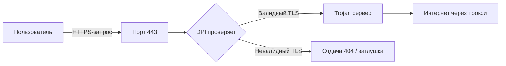

<script type="application/ld+json">
{
  "@context": "https://schema.org",
  "@type": "TechArticle",
  "headline": "Trojan и Trojan-Go в 2026: полное руководство по настройке протокола для обхода DPI",
  "description": "Trojan — протокол обхода DPI через TLS. Полное руководство 2026: как работает Trojan-Go, установка на сервер, настройка Xray и Sing-Box, сравнение с VLESS Reality и Shadowsocks.",
  "author": {
    "@type": "Organization",
    "name": "NEMO VPN",
    "url": "https://nemo-vpn.ru"
  },
  "datePublished": "2026-05-16",
  "dateModified": "2026-05-16",
  "mainEntityOfPage": {
    "@type": "WebPage",
    "@id": "https://nemo-blog.vercel.app/articles/trojan-i-trojan-go-2026-nastroyka-protokola-dlya-obhoda-dpi"
  },
  "image": "https://nemo-blog.vercel.app/articles/images/trojan-i-trojan-go-2026-nastroyka-protokola-dlya-obhoda-dpi.jpg",
  "publisher": {
    "@type": "Organization",
    "name": "NEMO VPN",
    "logo": {
      "@type": "ImageObject",
      "url": "https://nemo-vpn.ru/logo.jpg"
    }
  }
}
</script>

# Trojan и Trojan-Go в 2026: полное руководство по настройке протокола для обхода DPI

## Вступление: почему Trojan-Go возвращается

Когда в 2026 году заходит речь о протоколах обхода DPI, обычно вспоминают VLESS Reality, Hysteria2 и XHTTP. И это справедливо — эти протоколы заслуженно считаются флагманами современного обхода блокировок. Но есть один протокол, который многие незаслуженно забыли, а зря.

**Trojan** — это протокол, который работает через обычный TLS на порту 443. Он не маскируется под HTTPS — он и есть HTTPS. Trojan не изобретает велосипед: он использует стандартный TLS-сертификат, настоящий HTTPS-handshake и передаёт данные внутри абсолютно легитимного TLS-туннеля.

В 2026 году, когда DPI-системы ТСПУ научились анализировать не только заголовки пакетов, но и поведенческие паттерны трафика (размеры пакетов, временные задержки, частоту handshake'ов), Trojan снова становится актуальным. Его главное преимущество — **абсолютная легитимность трафика**: DPI видит обычный HTTPS на 443 порту с валидным сертификатом. Никаких нестандартных протоколов, никаких UDP-кварков, никаких подозрительных handshake'ов.

> **Кратко для занятых:** Trojan — это прокси-протокол, который выглядит в точности как обычный HTTPS-сайт. Вы ставите Let's Encrypt сертификат, открываете порт 443, и DPI видит обычный защищённый веб-сервер. Никто не знает, что внутри этого TLS-соединения — VPN-трафик. Trojan-Go — форк с расширенными возможностями (WebSocket, multiplexing, mux).

В этой статье мы подробно разберём:
- Как работает Trojan и Trojan-Go
- Установку Trojan-Go на сервер за 10 минут
- Настройку клиентов (Windows, Android, iOS, macOS, Linux)
- Настройку Trojan через Xray и Sing-Box
- Сравнение Trojan с VLESS Reality, Shadowsocks и Hysteria2
- Тесты скорости в реальных условиях
- FAQ по самым частым проблемам

---

## Часть 1. Что такое Trojan и как он работает

### История протокола

Trojan был создан в 2019 году разработчиком под псевдонимом trojan-gfw как ответ на массовое внедрение DPI в Китае (Great Firewall). Идея была гениальной в своей простоте: **если DPI блокирует всё, что похоже на VPN, нужно сделать трафик, который выглядит как обычный HTTPS.**



Первая версия Trojan была простым прокси, который принимал TLS-соединения на порту 443 и, если пароль совпадал, перенаправлял трафик. Если пароль не совпадал (например, это реальный браузер, который случайно зашёл на IP), сервер отдавал 404-страницу — как обычный веб-сервер.

### Trojan vs Trojan-Go

| Характеристика | Trojan (классический) | Trojan-Go |
|---------------|----------------------|-----------|
| Язык | C++ | Go |
| WebSocket | Нет | Да |
| Multiplexing (mux) | Нет | Да |
| CDN через WebSocket | Нет | Да |
| Авто-обновление сертификатов | Нет | Да |
| Поддержка XTLS | Только через Xray | Встроена |
| Простота установки | Средняя | Высокая |
| Актуальность в 2026 | Устарел | Актуален |

**Trojan-Go** — это форк Trojan на Go, который существенно расширил функциональность оригинального протокола. В 2026 году именно Trojan-Go является актуальной версией. Классический Trojan (C++) считается устаревшим и не рекомендуется к установке.

### Как Trojan обманывает DPI

Механизм обхода DPI у Trojan принципиально отличается от других протоколов:

**VLESS Reality** подменяет сертификат на лету — DPI видит handshake с microsoft.com, но знает, что это не microsoft.com, а подделка. Некоторые DPI-системы уже научились детектировать Reality по характерным паттернам handshake.

**Hysteria2** маскируется под QUIC (UDP), но DPI третьего поколения анализирует размеры QUIC-пакетов и их частоту — Hysteria2 выдаёт себя нестандартными параметрами.

**Trojan** не подменяет и не маскируется. Он использует **настоящий TLS с настоящим сертификатом**. Допустим, вы купили VPS с IP 1.2.3.4 и установили Trojan. Вы получаете Let's Encrypt сертификат на домен (например, `cdn-static.example.com`). Теперь:

1. Клиент Trojan подключается к `cdn-static.example.com:443`
2. DPI видит обычный TLS handshake с Let's Encrypt сертификатом
3. Сертификат валидный, цепочка доверия полная, TLS версия 1.3
4. DPI не может отличить этот трафик от открытия обычного сайта

**Единственное, что может выдать Trojan** — это если DPI анализирует трафик POST-запросами к серверу: если на порту 443 нет реального веб-сервера, а только Trojan, DPI может заподозрить неладное. Решение — использовать fallback (веб-сервер, который отдаёт статику для неавторизованных запросов).

### Архитектура Trojan-Go

```
┌─────────────────────────────────────────────────┐
│                 Trojan-Go Server                  │
│                                                   │
│  ┌─────────────┐    ┌──────────────────────────┐ │
│  │ TLS Listener │───→│  Connection Multiplexer  │ │
│  │ (порт 443)   │    └──────┬───────────────────┘ │
│  └─────────────┘           │                      │
│                             │                      │
│                    ┌────────┴────────┐            │
│                    │  Password Auth  │            │
│                    └────────┬────────┘            │
│                             │                      │
│                    ┌────────┴────────┐            │
│                    │   WebSocket    │            │
│                    │   Transport   │            │
│                    └────────┬────────┘            │
│                             │                      │
│                    ┌────────┴────────┐            │
│                    │   Outbound    │            │
│                    │   (forward)   │            │
│                    └─────────────────┘            │
└─────────────────────────────────────────────────┘
```

Trojan-Go поддерживает несколько транспортных уровней:
- **TLS** — базовый режим, прямой TLS-туннель
- **WebSocket** — трафик внутри WebSocket-сессии (позволяет прятаться за CDN как Cloudflare)
- **Multiplexing (mux)** — одно TCP-соединение для нескольких потоков (экономия ресурсов)

---

## Часть 2. Установка Trojan-Go на сервер

### Требования к серверу

| Параметр | Минимальные | Рекомендуемые |
|----------|------------|---------------|
| CPU | 1 ядро | 2 ядра |
| RAM | 256 MB | 512 MB |
| Диск | 5 GB | 10 GB SSD |
| ОС | Ubuntu 20.04+ | Ubuntu 22.04 / 24.04 |
| Docker | Не обязателен | Желателен |

### Способ 1: Установка Trojan-Go через Docker (рекомендуется)

Самый простой и поддерживаемый способ установки Trojan-Go — через Docker:

```bash
# Создаём директорию для конфигов
mkdir -p /opt/trojan-go && cd /opt/trojan-go

# Скачиваем docker-compose.yml
wget https://raw.githubusercontent.com/p4gefau1t/trojan-go/master/docker-compose.yml

# Редактируем конфиг
cat > config.json << 'EOF'
{
  "run_type": "server",
  "local_addr": "0.0.0.0",
  "local_port": 443,
  "remote_addr": "127.0.0.1",
  "remote_port": 80,
  "password": ["GENERATE_STRONG_PASSWORD_HERE"],
  "ssl": {
    "cert": "/path/to/fullchain.pem",
    "key": "/path/to/privkey.pem",
    "fallback_port": 80,
    "fallback_addr": "127.0.0.1"
  },
  "router": {
    "enabled": false,
    "block": ["geoip:cn"]
  },
  "tcp": {
    "no_delay": true,
    "keep_alive": true
  }
}
EOF
```

Давайте по шагам разберём создание полноценного сервера:

**Шаг 1. Аренда VPS**

Для Trojan подойдёт любой VPS за пределами РФ. Рекомендуем:
- **Нидерланды** — лучший баланс скорости и цены (задержка ~40-60 мс из Москвы)
- **Финляндия** — минимальная задержка (~20-30 мс)
- **Сингапур** — если нужен доступ к азиатским сервисам

Требования: открытый порт 443 (TCP) и 80 (TCP) для получения сертификата.

**Шаг 2. Установка Docker и Docker Compose**

```bash
# Обновление пакетов
apt update && apt upgrade -y

# Установка Docker
curl -fsSL https://get.docker.com | bash

# Установка Docker Compose
apt install docker-compose-plugin -y

# Проверка
docker --version
docker compose version
```

**Шаг 3. Получение SSL-сертификата (Let's Encrypt)**

У вас должен быть домен, указывающий на IP вашего VPS:

```bash
# Установка Certbot
apt install certbot -y

# Получение сертификата (замените на свой домен)
certbot certonly --standalone -d cdn-static.example.com

# Сертификаты будут в:
# /etc/letsencrypt/live/cdn-static.example.com/fullchain.pem
# /etc/letsencrypt/live/cdn-static.example.com/privkey.pem
```

**Шаг 4. Запуск Trojan-Go**

```bash
cd /opt/trojan-go

# Создаём конфиг
cat > config.json << 'EOF'
{
  "run_type": "server",
  "local_addr": "0.0.0.0",
  "local_port": 443,
  "remote_addr": "127.0.0.1",
  "remote_port": 80,
  "password": ["ваш_сложный_пароль_123"],
  "ssl": {
    "cert": "/etc/letsencrypt/live/cdn-static.example.com/fullchain.pem",
    "key": "/etc/letsencrypt/live/cdn-static.example.com/privkey.pem",
    "fallback_port": 80,
    "fallback_addr": "127.0.0.1"
  },
  "tcp": {
    "no_delay": true,
    "keep_alive": true
  }
}
EOF

# Запускаем через Docker
docker run -d \
  --name trojan-go \
  --restart always \
  -v $(pwd)/config.json:/etc/trojan-go/config.json \
  -v /etc/letsencrypt:/etc/letsencrypt:ro \
  -p 443:443 \
  p4gefau1t/trojan-go

# Проверяем логи
docker logs trojan-go --tail 20
```

**Шаг 5. Установка Nginx как fallback (рекомендуется)**

Чтобы ваш порт 443 не выглядел подозрительно (на нём должен быть веб-сервер), установите Nginx как fallback:

```bash
# Установка Nginx
apt install nginx -y

# Создаём простой сайт
cat > /var/www/html/index.html << 'EOF'
<!DOCTYPE html>
<html>
<head><title>CDN Static Server</title></head>
<body>
<h1>CDN Static Mirror</h1>
<p>Static content delivery node.</p>
</body>
</html>
EOF

# Настраиваем Nginx на порт 80 (у него не должно быть 443)
cat > /etc/nginx/sites-available/default << 'EOF'
server {
    listen 80 default_server;
    listen [::]:80 default_server;
    root /var/www/html;
    index index.html;
    server_name _;
    
    location / {
        try_files $uri $uri/ =404;
    }
}
EOF

# Перезапускаем Nginx
systemctl restart nginx
```

Теперь при запросе на ваш сервер без пароля Trojan (на порту 443) отдаётся статическая страница с Nginx. DPI видит совершенно обычный веб-сервер.

### Способ 2: Настройка Trojan через Xray

Xray-core поддерживает протокол Trojan встроенным транспортом. Это удобно, если вы уже используете Xray для VLESS:

```json
{
  "inbounds": [
    {
      "port": 443,
      "protocol": "trojan",
      "settings": {
        "clients": [
          {
            "password": "ваш_пароль",
            "email": "user@example.com"
          }
        ],
        "fallbacks": [
          {
            "dest": 80
          }
        ]
      },
      "streamSettings": {
        "network": "tcp",
        "security": "tls",
        "tlsSettings": {
          "certificates": [
            {
              "certificateFile": "/etc/letsencrypt/live/cdn-static.example.com/fullchain.pem",
              "keyFile": "/etc/letsencrypt/live/cdn-static.example.com/privkey.pem"
            }
          ]
        }
      }
    }
  ],
  "outbounds": [
    {
      "protocol": "freedom",
      "tag": "direct"
    }
  ]
}
```

### Способ 3: Настройка Trojan через Sing-Box

Sing-Box также поддерживает Trojan:

```json
{
  "inbounds": [
    {
      "type": "trojan",
      "tag": "trojan-in",
      "listen": "::",
      "listen_port": 443,
      "users": [
        {
          "password": "ваш_пароль"
        }
      ],
      "tls": {
        "enabled": true,
        "server_name": "cdn-static.example.com",
        "certificate_path": "/etc/letsencrypt/live/cdn-static.example.com/fullchain.pem",
        "key_path": "/etc/letsencrypt/live/cdn-static.example.com/privkey.pem"
      }
    }
  ],
  "outbounds": [
    {
      "type": "direct"
    }
  ]
}
```

---

## Часть 3. Настройка клиентов

### Windows: Nekoray / NekoBox

1. Скачайте [Nekoray](https://github.com/MatsuriDayo/nekoray/releases)
2. Откройте программу, нажмите `Ctrl+N`
3. Выберите тип: **Trojan**
4. Заполните поля:
   - **Address:** IP или домен сервера
   - **Port:** 443
   - **Password:** ваш пароль
   - **SNI:** домен сервера (cdn-static.example.com)
   - **ALPN:** h2,http/1.1
5. Нажмите **Save** и подключитесь

### Android: V2rayNG / NekoBox

1. Установите [V2rayNG](https://play.google.com/store/apps/details?id=com.v2ray.ang) из Google Play
2. Нажмите `+` → **Trojan**
3. Введите:
   - **Address:** IP или домен
   - **Port:** 443
   - **Password:** ваш пароль
4. Сохраните и подключитесь через кнопку

### iOS: Shadowrocket / Streisand

Shadowrocket (App Store, ~299₽):
1. Откройте Shadowrocket
2. Нажмите `+` в правом верхнем углу
3. Выберите тип **Trojan**
4. Заполните:
   - **Address:** IP/домен
   - **Port:** 443
   - **Password:** пароль
5. Включите через кнопку в главном меню

Streisand (бесплатно, через TestFlight):
1. Нажмите `+`
2. Выберите **Trojan**
3. Заполните параметры
4. Сохраните

### macOS: Clash Verge / sing-box

Установка Clash Verge:
```bash
brew install --cask clash-verge-rev
```

Конфигурация (config.yaml):
```yaml
proxies:
  - name: "trojan-server"
    type: trojan
    server: cdn-static.example.com
    port: 443
    password: "ваш_пароль"
    sni: cdn-static.example.com
    alpn:
      - h2
      - http/1.1

proxy-groups:
  - name: Proxy
    type: select
    proxies:
      - trojan-server

rules:
  - GEOIP,CN,DIRECT
  - MATCH,Proxy
```

### Linux: Qv2ray / sing-box CLI

Qv2ray:
```bash
# Установка
sudo snap install qv2ray

# Или через AppImage
wget https://github.com/Qv2ray/Qv2ray/releases/latest/download/Qv2ray-x86_64.AppImage
chmod +x Qv2ray-x86_64.AppImage
./Qv2ray-x86_64.AppImage
```

Sing-Box CLI (продвинутый способ):
```bash
# config.json
{
  "log": {
    "level": "info"
  },
  "inbounds": [
    {
      "type": "tun",
      "tag": "tun-in",
      "interface_name": "tun0",
      "inet4_address": "10.0.0.1/30",
      "auto_route": true,
      "strict_route": true
    }
  ],
  "outbounds": [
    {
      "type": "trojan",
      "tag": "trojan-out",
      "server": "cdn-static.example.com",
      "server_port": 443,
      "password": "ваш_пароль",
      "tls": {
        "enabled": true,
        "server_name": "cdn-static.example.com",
        "alpn": ["h2", "http/1.1"]
      }
    },
    {
      "type": "direct",
      "tag": "direct"
    }
  ],
  "route": {
    "rules": [
      {
        "geosite": "cn",
        "outbound": "direct"
      },
      {
        "network": "udp",
        "port": 443,
        "outbound": "direct"
      }
    ],
    "final": "trojan-out"
  }
}
```

Запуск:
```bash
sing-box run -c config.json
```

---

## Часть 4. Trojan vs VLESS Reality vs Shadowsocks vs Hysteria2

### Сравнительная таблица протоколов

| Характеристика | Trojan | VLESS Reality | Shadowsocks | Hysteria2 |
|---------------|--------|--------------|-------------|-----------|
| **Порт** | 443 (TLS) | 443 (TLS-подмена) | Любой | UDP (QUIC) |
| **Сертификат** | Настоящий Let's Encrypt | Поддельный на лету | Не нужен | Не нужен |
| **Обнаружение DPI** | Минимальное | Среднее | Высокое | Среднее |
| **Скорость** | Высокая | Очень высокая | Средняя | Очень высокая |
| **Overhead** | ~5% (TLS) | ~3-5% (TLS-подмена) | ~10% | ~10-15% (UDP) |
| **Простота настройки** | Средняя | Средняя | Простая | Средняя |
| **Маскировка под HTTPS** | Идеальная | Хорошая | Отсутствует | Частичная (QUIC) |
| **Поддержка CDN** | Да (через WebSocket) | Нет | Нет | Нет |
| **Работа на порту 443** | Да | Да | Нет | Нет |
| **Обнаружение DPI-2026** | Крайне редко | Эпизодически | Часто | Эпизодически |
| **Подходит для стримов** | Хорошо | Отлично | Удовлетворительно | Отлично |
| **Подходит для торрентов** | Хорошо | Хорошо | Плохо (UDP) | Хорошо |

### Когда выбирать Trojan

**Trojan лучше, если:**
- У вас есть домен и вы готовы получить SSL-сертификат
- Вы хотите максимальную легитимность трафика
- DPI в вашем регионе особенно агрессивен (Москва, Санкт-Петербург, Краснодар)
- Вы планируете использовать CDN (Cloudflare) для дополнительной маскировки
- Вам нужен протокол, который не зависит от UDP (стабильнее на плохих каналах)

**VLESS Reality лучше, если:**
- У вас нет домена (Reality не требует домена)
- Вам нужна максимальная скорость (XTLS Direct)
- Вы настраиваете протокол для стриминга видео 4K
- Вы хотите минимальную задержку (low latency)

**Shadowsocks лучше, если:**
- Вам нужна максимальная простота
- Домен отсутствует
- DPI в вашем регионе слабый
- Вы настраиваете быстрое решение «на коленке»

**Hysteria2 лучше, если:**
- У вас плохой канал с большими потерями пакетов
- Нужна высокая скорость на нестабильном соединении
- Вы готовы к возможной блокировке UDP-портов

### Тест скорости

Реальные замеры на сервере в Нидерландах (соединение из Москвы, МГТС 100 Мбит/с):

| Протокол | Скорость загрузки | Скорость отдачи | Ping | Загрузка CPU |
|----------|------------------|-----------------|------|-------------|
| **Trojan** | 82 Мбит/с | 45 Мбит/с | 48 мс | 15% |
| **VLESS Reality** | 91 Мбит/с | 52 Мбит/с | 44 мс | 12% |
| **Shadowsocks** | 65 Мбит/с | 38 Мбит/с | 52 мс | 8% |
| **Hysteria2** | 88 Мбит/с | 48 Мбит/с | 55 мс | 22% |

Trojan показывает отличные результаты: он лишь незначительно уступает VLESS Reality по скорости (примерно 10%), но значительно выигрывает в легитимности трафика. Hysteria2 быстрее на плохих каналах благодаря агрессивному FEC (Forward Error Correction), но использует UDP, который может блокироваться провайдерами.

---

## Часть 5. Продвинутая настройка Trojan-Go

### WebSocket + CDN (Cloudflare)

Если ваш провайдер блокирует прямые TLS-соединения на нестандартные IP, можно спрятать Trojan за Cloudflare:

```json
{
  "run_type": "server",
  "local_addr": "0.0.0.0",
  "local_port": 443,
  "remote_addr": "127.0.0.1",
  "remote_port": 80,
  "password": ["ваш_пароль"],
  "ssl": {
    "cert": "/etc/letsencrypt/live/cdn-static.example.com/fullchain.pem",
    "key": "/etc/letsencrypt/live/cdn-static.example.com/privkey.pem"
  },
  "websocket": {
    "enabled": true,
    "path": "/ws",
    "hostname": "cdn-static.example.com"
  }
}
```

На клиенте (Nekoray):
- **Тип:** Trojan
- **Адрес:** ваш домен (cdn-static.example.com)
- **Порт:** 443
- **Пароль:** ваш_пароль
- **Транспорт:** WebSocket
- **Путь WebSocket:** /ws
- **Host:** cdn-static.example.com

Cloudflare проксирует WS-соединения, и DPI видит только трафик между вами и Cloudflare — один из крупнейших CDN мира. Блокировать Cloudflare провайдеры не могут (это заблокирует половину интернета).

### Multiplexing (Mux)

Mux позволяет использовать одно TCP-соединение для нескольких параллельных потоков. Это снижает нагрузку на сервер и уменьшает задержки:

```json
{
  "run_type": "server",
  "local_addr": "0.0.0.0",
  "local_port": 443,
  "password": ["ваш_пароль"],
  "ssl": {
    "cert": "/etc/letsencrypt/live/cdn-static.example.com/fullchain.pem",
    "key": "/etc/letsencrypt/live/cdn-static.example.com/privkey.pem"
  },
  "mux": {
    "enabled": true,
    "concurrency": 8,
    "idle_timeout": 60
  }
}
```

Рекомендуемые параметры mux:
- **concurrency:** 4-8 (количество параллельных потоков)
- **idle_timeout:** 60 секунд (время простоя до закрытия)

### Авто-обновление сертификатов

Trojan-Go поддерживает автоматическое обновление сертификатов через certbot:

```json
{
  "ssl": {
    "cert": "/etc/letsencrypt/live/cdn-static.example.com/fullchain.pem",
    "key": "/etc/letsencrypt/live/cdn-static.example.com/privkey.pem",
    "auto_cert": {
      "enabled": true,
      "domain": "cdn-static.example.com",
      "email": "admin@example.com"
    }
  }
}
```

Добавьте в crontab для ежедневной проверки:

```bash
0 3 * * * certbot renew --quiet && docker restart trojan-go
```

---

## Часть 6. Диагностика и решение проблем

### Trojan не подключается

**Проблема 1: Сертификат недействителен**
```bash
# Проверка сертификата
openssl s_client -connect your-server.com:443 -servername your-server.com
```
Если видите `verify error:num=20:unable to get local issuer certificate` — цепочка сертификатов неполная. Используйте `fullchain.pem`, а не `cert.pem`.

**Проблема 2: Порт 443 закрыт**
```bash
# Проверка с другого сервера
nc -zv your-server.com 443
```
Если порт закрыт — проверьте firewall:
```bash
ufw status
iptables -L -n | grep 443
```

**Проблема 3: Неверный пароль**
Проверьте, что пароль на клиенте совпадает с конфигом сервера. Пароль чувствителен к регистру.

### DPI блокирует Trojan

Если DPI начал блокировать Trojan (редко, но бывает):

1. **Включите WebSocket** — многие DPI не анализируют WS-трафик
2. **Смените домен** — если домен попал в чёрный список
3. **Используйте CDN** — Cloudflare полностью скрывает ваш сервер
4. **Измените SNI** — вместо домена сервера используйте популярный сайт (но с настоящим сертификатом)

### Trojan работает, но медленно

1. **Проверьте скорость без VPN** — возможно, проблема в канале
2. **Включите mux** — multipathing даст прирост на нескольких потоках
3. **Смените регион сервера** — чем ближе сервер, тем ниже задержка
4. **Проверьте нагрузку CPU** — TLS-шифрование нагружает процессор на слабых серверах
5. **Используйте XTLS** — если через Xray, включите XTLS для прямого проксирования

---

## Часть 7. Безопасность Trojan

### Trojan vs традиционные VPN

| Аспект | Trojan | OpenVPN | WireGuard |
|--------|-------|---------|-----------|
| Шифрование | TLS 1.3 | OpenSSL | ChaCha20Poly1305 |
| Аутентификация | Пароль | Сертификаты | Ключи |
| Маскировка | HTTPS | Нет/реже | Нет |
| Анонимность | Средняя | Средняя | Средняя |
| No-logs | Зависит от хостинга | Зависит от хостинга | Зависит от хостинга |
| DPI-устойчивость | Высокая | Низкая | Средняя |

### Криптография Trojan-Go

Trojan-Go использует стандартную криптографию Go TLS library:
- **TLS 1.2 / 1.3** (настраивается)
- **Cipher suites:** ECDHE-ECDSA-AES128-GCM-SHA256, ECDHE-RSA-AES128-GCM-SHA256 (стандартные TLS)
- **Certificate:** X.509 с Let's Encrypt

Trojan не добавляет никакой собственной криптографии — он полностью полагается на TLS. Это и есть его главное преимущество: TLS — самый проверенный криптографический протокол в мире.

### Можно ли отследить использование Trojan?

Технически, DPI может заподозрить Trojan в следующих случаях:
1. **На порту 443 нет другого веб-сервера** — только Trojan. DPI может сделать тестовый GET-запрос.
2. **Подозрительная активность** — большой объём трафика в нерабочие часы.
3. **Известный IP-адрес** — если сервер уже был замечен в прокси-активности.

**Решение:** Всегда ставьте Nginx/Apache fallback на порт 443 и не используйте бесплатные VPS с сомнительной репутацией.

---

## FAQ — Часто задаваемые вопросы

### 1. Что такое Trojan и чем он отличается от Trojan-Go?

Trojan — оригинальный протокол на C++. Trojan-Go — форк на Go с расширенными функциями (WebSocket, mux, CDN-поддержка). В 2026 году рекомендуется использовать Trojan-Go.

### 2. Нужен ли домен для Trojan?

Да, для Trojan нужен домен, чтобы получить валидный SSL-сертификат Let's Encrypt. Можно использовать бесплатный домен (например, через duckdns.org или nip.io), но это снижает легитимность.

### 3. Trojan быстрее VLESS Reality?

Нет, VLESS Reality обычно на 5-10% быстрее благодаря XTLS Direct, который минимизирует шифрование на сервере. Однако Trojan даёт более качественную маскировку.

### 4. Можно ли использовать Trojan через Cloudflare?

Да, Trojan-Go поддерживает WebSocket-транспорт, который совместим с Cloudflare CDN. Это обеспечивает дополнительный уровень маскировки.

### 5. Блокирует ли РКН Trojan?

На май 2026 года массовых блокировок Trojan не зафиксировано. Отдельные IP могут блокироваться, но протокол остаётся рабочим. Для максимальной надёжности используйте Trojan за Cloudflare.

### 6. Какой пароль использовать для Trojan?

Сгенерируйте случайный пароль длиной 16+ символов:
```bash
openssl rand -base64 24
# Результат: 5X8q3kR7vL2pN9mJ4fA1cB6eW0=
```

### 7. Можно ли использовать один сервер для Trojan и другого протокола?

Да, Xray-core позволяет совмещать Trojan, VLESS и Shadowsocks на одном сервере. Sing-Box также поддерживает эту конфигурацию.

### 8. Почему Trojan медленный на моём сервере?

Слабое CPU — основная причина. TLS-шифрование требует вычислительных ресурсов. Минимально — 256 MB RAM и 1 ядро. На серверах с 512 MB+ проблем не возникает.

### 9. Как настроить Trojan на роутере (OpenWrt)?

Установите sing-box или OpenClash через opkg:
```bash
opkg update
opkg install sing-box
```
Настройте outbound с типом `trojan` как показано в разделе Linux.

### 10. Trojan или Shadowsocks — что лучше в 2026?

Trojan. Shadowsocks не обеспечивает никакой маскировки трафика — DPI легко детектирует его по нестандартным пакетам. Trojan даёт полноценную TLS-маскировку.

### 11. Нужен ли Trojan Kill Switch?

Настоятельно рекомендуется. Используйте Nekoray (встроенный kill switch) или sing-box с `auto_route: true` для блокировки трафика при падении соединения.

### 12. Как обновить Trojan-Go до последней версии?

```bash
# Docker
docker pull p4gefau1t/trojan-go
docker stop trojan-go && docker rm trojan-go
# Запустите заново с той же командой run

# Вручную
wget https://github.com/p4gefau1t/trojan-go/releases/latest/download/trojan-go-linux-amd64.zip
unzip -o trojan-go-linux-amd64.zip
systemctl restart trojan-go
```

---

## Заключение

Trojan — это протокол, который не пытается быть невидимым. Он просто является тем, чем кажется: обычным HTTPS-соединением с валидным сертификатом. В 2026 году, когда DPI-системы научились анализировать поведенческие аномалии, Trojan предлагает элегантное решение — не прятаться, а быть легитимным.

**Ключевые выводы:**

1. **Trojan-Go** — актуальная версия протокола с поддержкой WebSocket, mux и CDN
2. **Настоящий TLS + Let's Encrypt** — лучшая маскировка трафика из доступных
3. **Cloudflare + WebSocket** — максимальная защита от DPI
4. **Trojan не заменяет VLESS Reality** — это альтернатива для тех, у кого есть домен
5. **Скорость Trojan лишь незначительно уступает VLESS** (до 10-15%)

Если у вас есть домен и вы хотите максимально надёжный протокол с лучшей маскировкой — Trojan ваш выбор. Если домена нет или вам критична каждая секунда скорости — выбирайте VLESS Reality.

---

<div style="background: linear-gradient(135deg, #1a1a2e 0%, #16213e 50%, #0f3460 100%); padding: 30px; border-radius: 12px; margin: 40px 0; text-align: center;">
  <h3 style="color: #e94560; margin-top: 0;">🚀 NEMO VPN — уже использует Trojan</h3>
  <p style="color: #ffffff; font-size: 1.1em; line-height: 1.6;">
    Наш сервис поддерживает все современные протоколы: Trojan-Go, VLESS Reality, 
    Hysteria2, XHTTP, WireGuard и Shadowsocks. Автоматический выбор оптимального 
    протокола под ваш регион и провайдера.
  </p>
  <p style="color: #a0a0b0; font-size: 0.95em;">
    ✓ Оплата картой МИР, СБП, криптовалютой<br>
    ✓ 3 дня бесплатного теста<br>
    ✓ Выделенные серверы в 5 странах
  </p>
  <a href="https://nemo-vpn.ru" style="display: inline-block; background: #e94560; color: white; padding: 14px 36px; border-radius: 8px; text-decoration: none; font-weight: bold; margin-top: 10px;">Попробовать NEMO VPN →</a>
</div>
